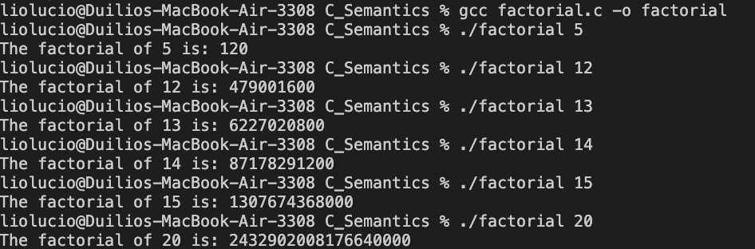

# CS333 - Project 3 - README
### Duilio Lucio
### 10/23/2024

***Google Sites Report: https://sites.google.com/colby.edu/duiliocs333 ***

## Directory Layout:
```
├── C++_Semantics
│   ├── C++_Semantics_Images
│   │   ├── bubbleSort.png
│   │   ├── clltest_output.png
│   │   └── wordCountC++_output.png
│   ├── bubbleSort
│   ├── bubbleSort.cpp
│   ├── clltest
│   ├── clltest.cpp
│   ├── linkedList.h
│   ├── task5Examples
│   │   ├── inputInfo.cpp
│   │   ├── noURLSupport.cpp
│   │   └── openCloseReadFile.cpp
│   ├── wordCount.cpp
│   ├── wordCountC++
│   └── wordCountTest.txt
├── C_Semantics
│   ├── C_Semantics_Images
│   │   ├── clltest_output.png
│   │   ├── factorial.png
│   │   ├── quickSort.png
│   │   └── wordCounter_output.png
│   ├── clltest
│   ├── clltest.c
│   ├── factorial
│   ├── factorial.c
│   ├── linkedList.c
│   ├── linkedList.h
│   ├── quickSort.c
│   ├── quicksort
│   ├── wordCounter
│   ├── wordCounter.c
│   └── wordCounterTest.txt
└── README.md

```

## OS and C compiler
OS: OSX Ventura 13.6.7 
C compiler: Apple clang version 15.0.0 (clang-1500.0.40.1)

## Part I 

###task 1
**Compile:** $ gcc quickSort.c -o quicksort

**Run:** $ ./quickSort

**Output:**


###task 2
**Compile:** $ gcc factorial.c -o factorial

**Run:** $ ./factorial 5
           ./factorial 12
           ./factorial 13
           ./factorial 14
           ./factorial 15
           ./factorial 20

In the factorial function we utilize long long to store larger number since int cant handle values beyond 12!, as well as having an error handler for negative inputs which returns -1 and an error message. In the case of a factorial of 0 or 1 then we return 1, and the main line of code is the for loop which multiplies the result by all real number from 2 to n to make up the factorial. We create a function pointer to point to the factorial function in the function pointer calc. In the command-line argument handling then we check if only one argument is passed and if the argument passed is incorrect we print an error message, we also utilize atoi() to convert the string input to an integer. We then print the result if the calculation was successful by using %lld to print the long long integers. but if it was incorrect which prints out -1 then we know the input was invalid.

**Output:**


###task 3
**Compile:** $ gcc -o clltest clltest.c linkedList.c

**Run:** $ ./clltest

**Output:**


The freefunc parameter is necessary in order to ensure all dynamically allocated data is freed when clearing the list, because without the parameter only nodes themselves would be freed and the memory allocated would result in a memory leak.

## Part II - C++ 
###task 1 
**Compile:** $ g++ -std=c++11 bubbleSort.cpp -o bubbleSort

**Run:** ./bubbleSort

**Output:**


###task 2 
**Compile:** $ g++ -o clltest clltest.cpp

**Run:** ./clltest

**Output:**


###task 4 
**Compile:** $ g++ -std=c++11 -o wordCountC++ wordCount.cpp

**Run:** ./wordCountC++ wordCountTest.txt 

**Output:**

